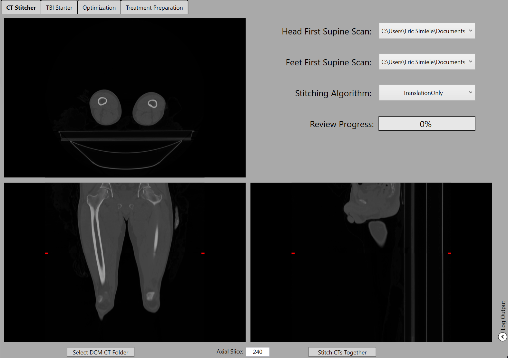

# CTStitcher

CTStitcher is a collection of tools designed to streamline the planning process for VMAT Total Body Irradiation (TBI) cases. The primary feature of this application is its ability to stitch together two separate CT scans (typically one Head-First Supine and one Feet-First Supine) into a single, cohesive scan. This is particularly useful when a CT scanner cannot capture the entire length of a patient in a single scan.

## Features

*   **CT Stitching:** Combines two separate CT scans into a single DICOM series.
*   **3DOF Stitching Algorithm:** Provides a robust stitching algorithm to combine the scans.
*   **Interactive Review:** Allows for interactive review of the stitched CT scan before exporting, including zooming and panning capabilities.
*   **DICOM Export:** Exports the stitched CT scan to a DICOM format that can be imported into a treatment planning system.
*   **Varian Eclipse Integration:** Designed to be used as a plugin within the Varian Eclipse Treatment Planning System.

## Technical Details

*   **Language:** C#
*   **Framework:** .NET Framework 4.72
*   **Platform:** Windows (x64)
*   **UI:** Windows Presentation Foundation (WPF)
*   **IDE:** Visual Studio
*   **Key Libraries:**
    *   **CommunityToolkit.Mvvm:** For implementing the MVVM pattern.
    *   **EvilDICOM:** For handling DICOM files.
    *   **SimpleITK:** For medical image processing.
    *   **VMS.TPS.Common.Model.API:** For integration with the Varian Eclipse Treatment Planning System.

## Project Structure

The project is organized into the following folders:

*   `CTStitcher/`: Contains the main source code for the WPF application.
*   `CTStitcher/CTStitcherTests/`: Contains unit tests for the application.
*   `CTStitcher/Resources/`: Contains necessary resources and libraries, such as the Varian ESAPI libraries and SimpleITK.
*   `Docs/`: Contains documentation and images for the project.

## Background

Many VMAT TBI programs do not have a CT scanner capable of capturing adult patients in one scan. Typically, two CT scans are acquired: one in HFS and one in FFS. These scans are registered in the planning software and two sets of plans are created:

*   AP/PA on the FFS scan
*   VMAT on the HFS scan

While this approach works, it can be a bit cumbersome to:

*   evaluate dose in the match region
*   evaluate dose to the entire target (i.e., body)

The ideal case is to use a single CT scan for planning to eliminate these issues. Some groups acquire HFS and FFS scans and concatenates them outside of the TPS using custom scripts. Other groups are working on similar functionality in Eclipse: [TXIHelper](https://github.com/Varian-MedicalAffairsAppliedSolutions/MAAS-TXIhelper/tree/main). This project is based on TXIHelper and expands on its functionality. Specifically,
- Provides ability for user to review stitching result prior to pushing to aria
- Cleaned up project structure for easier maintenance and expansion
- The original TXIHelper algorithm can take 30-40min depending on computing resources (from internal testing). This script provides an alternative algorithm that does not consider rotations (3DOF only), which is ~6 times faster than TXIHelper.

## Program and IFU

To run the program, the following steps need to be performed:

1.  Import the HFS and FFS CT scans to Eclipse.
2.  Create a 3DOF rigid registration between the two CT scans (no rotations!).
3.  Open the HFS scan in external beam planning.
4.  Launch the script.
5.  Make the appropriate assignments for the HFS and FFS scans in the UI.
6.  Hit "Stitch CTs Together" and wait. Runtime is ~5 min, with 30% of that time allocated to reformatting the data for viewing.
7.  Once the stitching is complete, you must review the final CT in the UI. The edges of the match slice (+/- 1 slice) are highlighted in red to indicate where the HFS and FFS scans were joined. The progress bar in the UI will show you the review progress. Be sure to look at the coronal and sagittal slices in addition to the axial.
8.  Once review is complete, a new button will appear and allow the user to write the stitched CT to DICOM format and push it to the Aria CT import location.
9.  Import the stitched CT scan. The stitched scan will share the same FOR as the HFS scan.
10. In external beam planning, toggle back and forth between the original HFS scan and the stitched CT and ensure they are identical.
11. Send the stitched CT to aria and plan on this scan.

## Risk Assessment and Testing

Per recommendations in [Carden et al.](https://aapm.onlinelibrary.wiley.com/doi/full/10.1002/acm2.13348):

*   **Code classification:** I B
*   **RPN:**
    *   Population: 4
    *   Intent: 10
    *   Complexity: 8
    *   **RPN = 4 x 10 x 8 = 320**

### Testing

CT stitcher can be tested using both dicom files and CT objects in Eclipse. The test CTs were created from a single HFS CT scan where:

*   Two images were created (original scan was cut in half).
*   Both scans were anonymized and exported.
*   The header information of one of the scans was modified to represent a FFS scan with a known offset between the two images.
*   Copies of the modified images were imported into Eclipse.
    *   Patient: $TBIResearch
        *   UpperTest
        *   LowerTest
    *   A 3DOF rigid registration was created between the two images.

## Important Notes and Assumptions

*   **CT Stitcher:** Only the 3DOF stitching algorithm is used clinically (still working on the 6DOF algorithm).

## Updates Summary

### 4/21/2025

*   Added ability to zoom and pan in CT stitcher to aid in reviewing image concatenation prior to pushing for autocontouring.
*   Updated all projects to be compatible with ESAPI v18.1 libraries.
*   Updated Stitched CT write path to v18 image server.
*   Conversion of all projects to MVVM architecture to improve maintainability.
